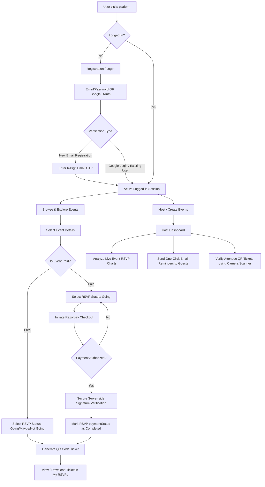

# Event RSVP System - Frontend Client 🚀

Welcome to the frontend application for the **Event RSVP System**. This is a modern, responsive single-page application (SPA) built using React, Vite, and Tailwind CSS. It provides users with a premium experience to discover events, RSVP with ticket generation, manage their profile, and view analytics as a host.

---

## 🛠️ Tech Stack

- **Core Framework:** [React 19](https://react.dev/) & [Vite](https://vite.dev/) (for ultra-fast builds and HMR)
- **Styling:** [Tailwind CSS v3](https://tailwindcss.com/) (for modern, responsive layouts)
- **Routing:** [React Router DOM v7](https://reactrouter.com/)
- **API Client:** [Axios](https://axios-http.com/) (configured with credentials for cookie-based session auth)
- **Data Visualization:** [Recharts](https://recharts.org/) (for interactive host dashboard analytics)
- **Rich Text Editor:** [React Quill](https://github.com/zenoamaro/react-quill) (for creating formatted event descriptions)
- **QR Code Support:** 
  - [qrcode.react](https://github.com/zpao/qrcode.react) (to generate entry tickets for events)
  - [@yudiel/react-qr-scanner](https://github.com/JodusNesta/react-qr-scanner) (for hosts to scan and verify tickets at the venue)
- **Authentication Providers:** [Google OAuth (@react-oauth/google)](https://github.com/MomenSherif/react-oauth)
- **Icons & Feedback:** [Lucide React](https://lucide.dev/) & [React Toastify](https://github.com/fkhadra/react-toastify)

---

## ✨ Key Features

### 👤 User Authentication & Security
- **Multiple Login Methods:** Sign in using email/password or seamless **Google OAuth**.
- **Email Verification (OTP):** Security verification using a 6-digit OTP sent to the user's email upon registration.
- **Forgot/Reset Password:** Secure flows to reset lost passwords using time-restricted OTP verification.
- **Profile Management:** Update profile details and upload custom profile pictures (uploaded directly to Cloudinary).

### 📅 Event Discovery & Interaction
- **Interactive Explore Page:** Filter events by categories, search by keywords (title, description, location), and navigate using fluid pagination.
- **Dynamic Event Details:** View rich event descriptions (including HTML formatting), date/time details, pricing, registration deadlines, and locations.
- **Interactive Comments Section:** Leave feedback, ask questions, or engage with other attendees on the event details page.

### 🎟️ RSVPs & Ticketing
- **Multi-Status RSVPs:** Choose between **Going**, **Maybe**, or **Not Going**.
- **Paid Event Workflows:** Fully integrated payment flow. RSVPs for paid events require a successful checkout before they are confirmed.
- **QR Ticket Generation:** Generates a secure QR code ticket for confirmed RSVPs, which acts as a virtual pass.

### 📊 Host & Admin Dashboards
- **Host Dashboard:** Create, update, or delete events. Contains a rich text editor for writing detailed event outlines.
- **Real-time Analytics:** Hosts can view deep analytics for their events (total RSVPs, RSVP breakdown chart, and total revenue) and send **email reminders** to attendees with a single click.
- **Ticket Scanner:** Integrated camera-based QR scanner for hosts to verify attendees at the door.
- **Admin Panel:** Administrative users can manage all registered platform users, view details, grant admin permissions, or delete inactive accounts.

---

## 🔄 Project Flow & Architecture

The diagram below outlines the core workflows of the application, showing how users, payments, tickets, and hosting management tie together:



### Flow Walkthrough

1. **Authentication Flow:** Users register and verify their accounts using a secure one-time password (OTP) delivered to their inbox. Alternatively, they can sign up with their Google accounts.
2. **Event & RSVP Flow:** Users browse events. Free events allow immediate RSVP status updates. Paid events require integration with the payment gateway (Razorpay). 
3. **Checkout & Ticketing Flow:** When a user pays for an event, Razorpay processes the transaction, the backend verifies the payment signature for security, the RSVP is marked as `completed`, and a secure QR code ticket is automatically rendered on the user's dashboard.
4. **Host Verification Flow:** Hosts manage their events, monitor interactive charts (via Recharts), email automated reminders, and use the device's camera to scan and verify QR code tickets at the event gate.

---

## 📁 Directory Structure

```text
client/
├── public/                 # Static assets (favicons, logos)
├── src/
│   ├── components/         # Shared UI components (Layout, Navbar, Footer, Route guards)
│   ├── context/            # Global state managers (AuthContext, ThemeContext)
│   ├── pages/              # Page view components (Home, Explore, Analytics, Login, etc.)
│   ├── services/           # Axios instance and base API configuration
│   ├── utils/              # Helper utilities (date formatters, QR helpers)
│   ├── App.css             # Main stylesheet overrides
│   ├── App.jsx             # App router definitions and main layout wrapper
│   ├── index.css           # Tailwind directives and custom theme variables
│   └── main.jsx            # Entry point initializing React and Auth providers
├── package.json            # Scripts and package dependencies
├── tailwind.config.js      # Tailwind CSS theme customization
└── vite.config.js          # Vite plugins and compiler configuration
```

---

## 🚀 Getting Started

### 1. Prerequisites
Ensure you have [Node.js](https://nodejs.org/) (v18.x or higher recommended) and `npm` installed.

### 2. Installation
Navigate into the `client` directory and install the dependencies:
```bash
npm install
```

### 3. Environment Configuration
Create a `.env` file in the `client/` root folder (or rename `.env.example` if available) and add the following configuration:
```env
# Google Client ID for OAuth login
VITE_GOOGLE_CLIENT_ID=your_google_client_id_here
```

### 4. Running the Application
Start the local development server:
```bash
npm run dev
```
The application will run on [http://localhost:5173](http://localhost:5173) by default.

### 5. Building for Production
To compile and optimize the assets for production:
```bash
npm run build
```
The production-ready bundle will be generated in the `dist/` directory. You can preview the production build locally using:
```bash
npm run preview
```

---

## 📝 Available Scripts

- `npm run dev` - Starts the Vite dev server with hot module replacement (HMR).
- `npm run build` - Builds the application for production.
- `npm run preview` - Locally previews the production build.
- `npm run lint` - Runs ESLint to find and report static code style issues.
